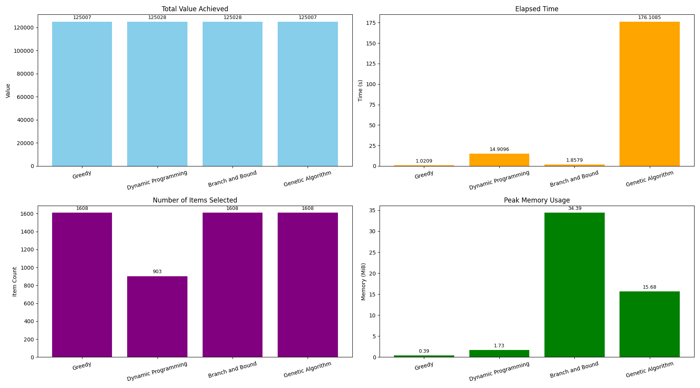

# Knapsack Problem Algorithm Comparison


<p align="center">
  <strong>A comprehensive implementation and performance comparison of various algorithms for solving the 0/1 Knapsack Problem</strong>
</p>

<p align="center">
  <em>Demonstrating trade-offs between solution quality, execution time, and memory usage across different algorithmic approaches</em>
</p>

---

## Overview

The **knapsack problem** is a classic optimization challenge: *select items to maximize value while staying within weight constraints*. 

This project showcases **4 powerful algorithms** with complete performance analysis:

```diff
+ 2 EXACT algorithms (guaranteed optimal solutions)
! 2 APPROXIMATE algorithms (fast, good solutions)
```

<div align="center">

| **Greedy** | **Dynamic Programming** | **Branch & Bound** | **Genetic Algorithm** |
|:----------:|:----------------------:|:------------------:|:---------------------:|
| Lightning Fast | Optimal Solution | Optimal Solution | Large-Scale Solver |

</div>

---

## Project Structure

```
Knapsack/
├── algorithm_comparison_with_items.png    # Visualization results
├── branch_and_bound.py                   # Branch and bound implementation
├── dataset_generator.py                  # Generates realistic test datasets
├── dynamic_programming.py               # DP implementation
├── genetic.py                           # Genetic algorithm implementation
├── greedy.py                           # Greedy algorithm implementation
├── knapsack_problem.py                 # Common dataset loading utilities
├── knapsack_realistic_3000.in         # Sample dataset (3000 items)
├── profiling_utils.py                 # Performance measurement tools
├── test_all.py                        # Main comparison script
└── readme.md                          # This file
```

---

## Quick Start

> **Prerequisites:** Python 3.6+ and matplotlib

<details>
<summary><strong>Installation & Setup</strong></summary>

```bash
# Clone the repository
git clone https://github.com/yourusername/Knapsack.git
cd Knapsack

# Install dependencies
pip install matplotlib
```

</details>

### Running the Comparison

```bash
# Run the complete algorithm comparison
python test_all.py
```

**Optional steps:**
```bash
# Generate custom dataset (optional - samples included)
python dataset_generator.py
```

---

## Algorithm Performance Overview

<div align="center">

| Algorithm | Type | Time Complexity | Space | Optimal? | Speed |
|:---------:|:----:|:---------------:|:-----:|:--------:|:-----:|
| **Greedy** | Approximate | `O(n log n)` | `O(1)` | ❌ | Fast |
| **Dynamic Programming** | **Exact** | `O(n × W)` | `O(W)` | ✅ | Medium |
| **Branch & Bound** | **Exact** | `O(2^n)` | `O(n)` | ✅ | Variable |
| **Genetic Algorithm** | Approximate | `O(generations)` | `O(population)` | ❌ | Medium |

</div>

---

## Algorithm Details

<details>
<summary><strong>EXACT ALGORITHMS</strong> - Click to expand</summary>

### Dynamic Programming ([`dynamic_programming.py`](dynamic_programming.py))

```diff
+ Guaranteed optimal solution
+ Handles medium-sized datasets efficiently
+ Well-established, reliable approach
- Memory intensive for large capacities
- Time complexity depends on capacity size
```

**Best for:** Medium datasets where optimality is crucial

---

### Branch and Bound ([`branch_and_bound.py`](branch_and_bound.py))

```diff
+ Optimal solution guaranteed
+ Can handle large capacities
+ Intelligent pruning reduces search space
+ Memory efficient
- Exponential worst-case time
- Performance varies with data distribution
```

**Best for:** Large capacity problems requiring optimal solutions

</details>

<details>
<summary><strong>APPROXIMATE ALGORITHMS</strong> - Click to expand</summary>

### Greedy Algorithm ([`greedy.py`](greedy.py))

```diff
+ Lightning-fast execution
+ Minimal memory usage
+ Simple implementation
+ Great for real-time applications
- No optimality guarantee
- Quality depends on data characteristics
```

**Best for:** When speed matters more than perfect solutions

---

### Genetic Algorithm ([`genetic.py`](genetic.py))

```diff
+ Handles massive datasets
+ Consistently good approximations
+ Highly customizable and extensible
+ Robust across different problem types
- No optimality guarantee
- Requires parameter tuning
- Longer execution time
```

**Best for:** Very large instances where other methods fail

</details>

---

## Performance Visualization

<p align="center">
  
</p>

<p align="center">
  <em>Performance comparison on 3000-item dataset (W=45544)</em><br>
  <em>Showing execution time, solution quality, and items selected</em>
</p>

---

## Benchmark Results

<details>
<summary><strong>Performance Metrics</strong> - Click to see detailed results</summary>

**Typical Results on 3000-item Dataset:**

- **Greedy Algorithm**: ~0.01s, Good approximation
- **Dynamic Programming**: Moderate time, OPTIMAL solution
- **Branch and Bound**: Variable time, OPTIMAL solution  
- **Genetic Algorithm**: Consistent time, Good approximation

</details>

---

## Dataset Format

```
Dataset Format:
<capacity>
<index> <value> <weight>
<index> <value> <weight>
...
```

<details>
<summary><strong>Example from knapsack_realistic_3000.in</strong></summary>

```
45544
0 99 82
1 68 88
2 54 85
3 56 93
...
```

</details>

---

## Custom Dataset Generation

Create your own datasets with [`generate_realistic_knapsack_dataset`](dataset_generator.py):

```python
generate_realistic_knapsack_dataset(
    num_items=3000,      # Number of items
    max_value=100,       # Maximum item value
    max_weight=100,      # Maximum item weight  
    capacity_ratio=0.3,  # Capacity as % of total weight
    output_file="custom_dataset.in"  # Output filename
)
```

---

## Contributing

Feel free to extend this project by:
- Implementing additional algorithms (simulated annealing, particle swarm, etc.)
- Adding more sophisticated genetic operators  
- Optimizing existing implementations
- Creating new benchmark datasets
- Improving visualizations

---

## License

[](https://opensource.org/licenses/MIT)

This project is licensed under the **MIT License**. See the [LICENSE](./LICENSE) file for details.

## Contact
For questions, suggestions, or contributions, please open an issue or submit a pull request on GitHub.